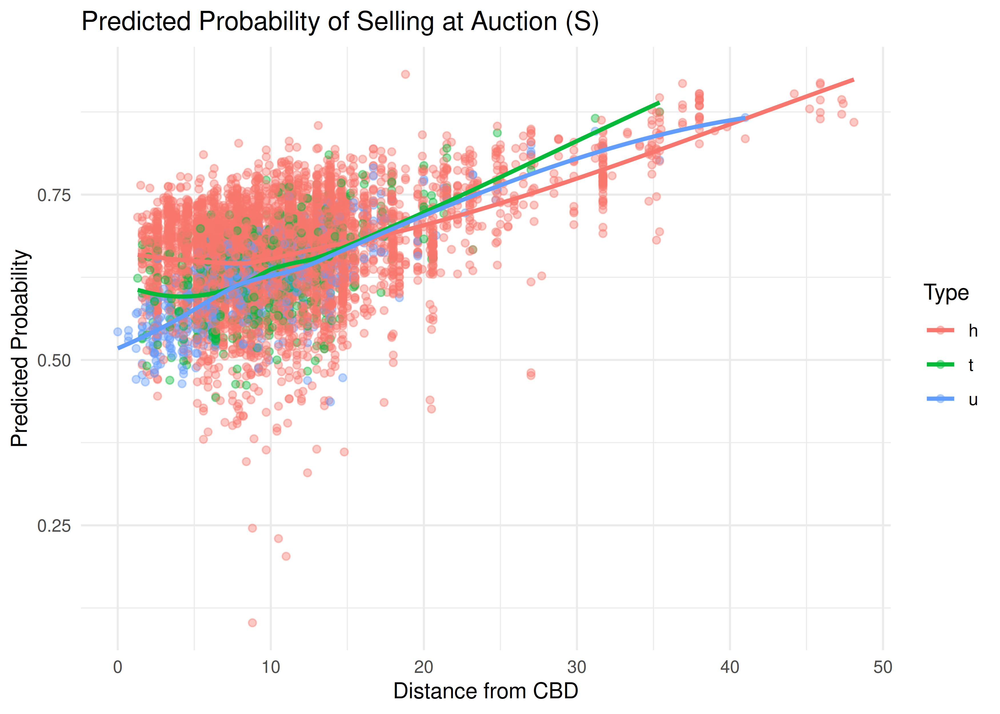
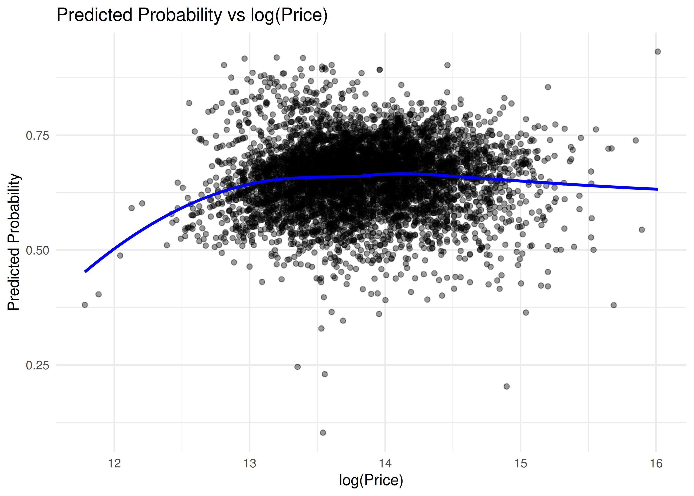
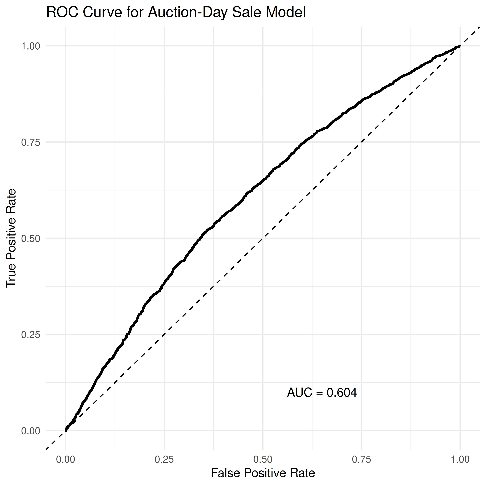
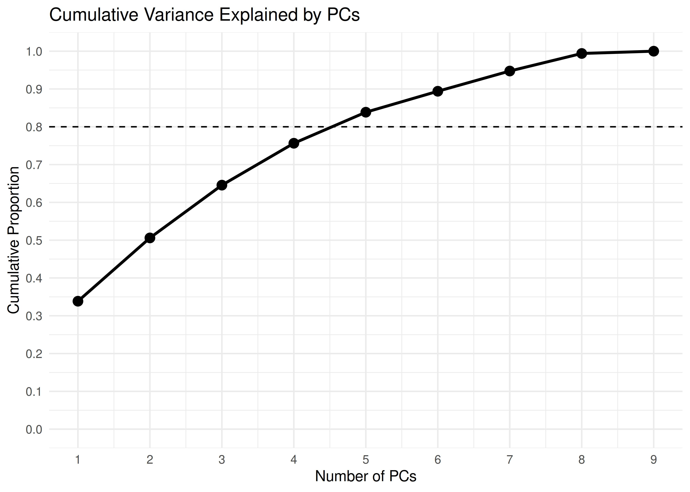
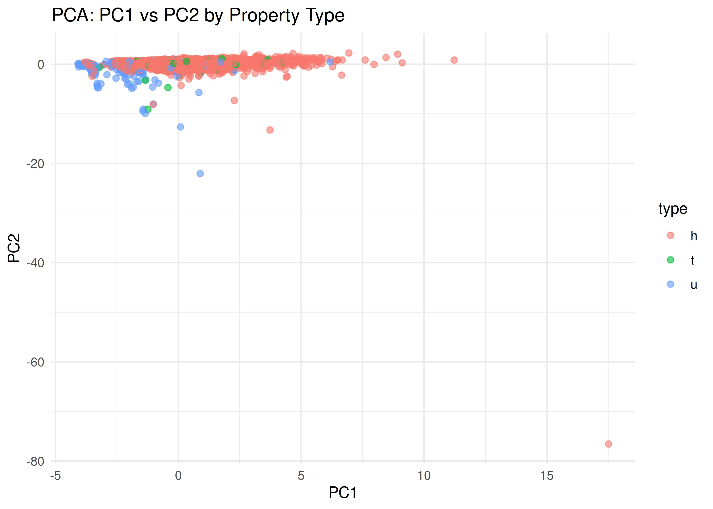
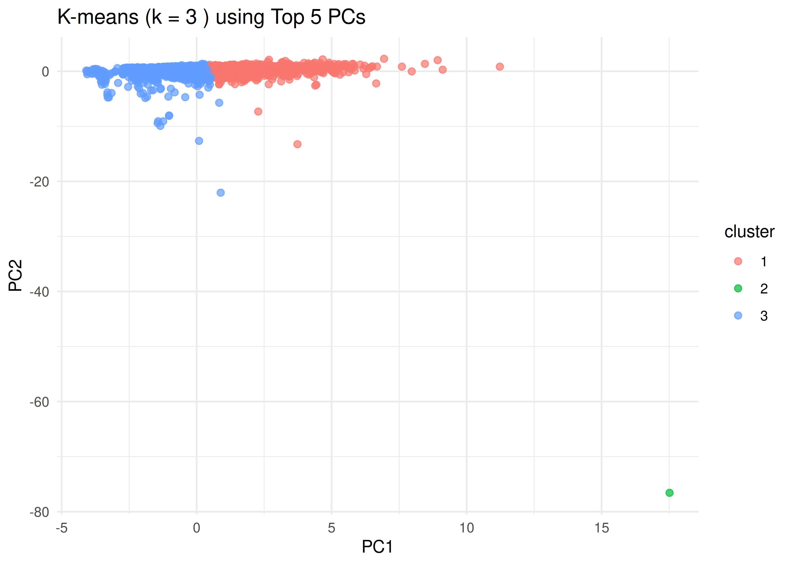

## Introduction

The Melbourne housing market is an active and competitive real estate environment, where properties differ widely in price, structure, and location. Understanding how these factors relate to selling outcomes and underlying market structure can provide insight into buyer behavior and housing dynamics.

This project uses the *Melbourne Housing Dataset*, scraped from weekly publicly available sales results on Domain.com.au. The dataset includes information on property characteristics, sale price, location, and method of sale.

Key variables include:

- **Price-related & structural features**:  
  - `Price`  
  - `Rooms`  
  - `Bathroom`  
  - `Car`  
  - `Landsize`  
  - `BuildingArea`

- **Location-related features**:  
  - `Distance`  
  - `Regionname`  
  - `CouncilArea`

- **Transaction-related features**:  
  - `Type`  
  - `Method`  
  - `Date`

Two key questions:

1. **Which housing features are associated with a higher probability of selling on the auction day?**  
   *Approach:* Logistic Regression.

2. **Do properties form distinct groups after dimensionality reduction?**  
   *Approach:* PCA + K-means clustering.

---

## Exploratory Analysis

```{r}
melb <- readRDS("derived_data/melb_cleaned.rds")
summary(melb[, c("price","rooms","bathroom","car","distance","landsize","building_area")])
table(Type = melb$type)
table(Method = melb$method)
```

---

## Logistic Regression

To examine factors associated with the probability of selling on auction day, we fit a logistic regression model with:

- **Outcome**: `sold_auction` (1 = sold at auction day, 0 = otherwise)  
- **Predictors**: `log_price`, `Rooms`, `Bathroom`, `Car`, `Distance`, `Type`

The model is specified as:

\[
\text{logit}(\Pr(\text{sold\_auction} = 1)) =
\beta_0 + \beta_1 \log(\text{Price}) +
\beta_2 \text{Rooms} + \beta_3 \text{Bathroom} +
\beta_4 \text{Car} + \beta_5 \text{Distance} +
\beta_6 \text{Type}.
\]

### Predicted Probability vs Distance

```{r, echo=FALSE, out.width="70%", fig.align='center'}

```

### Predicted Probability vs log(Price)

```{r, echo=FALSE, out.width="70%", fig.align='center'}

```

### ROC Curve

```{r, echo=FALSE, out.width="55%", fig.align='center'}

```

---

## PCA and Clustering

### Cumulative Variance Explained

```{r, echo=FALSE, out.width="70%", fig.align='center'}

```

### PCA Projection Colored by Property Type

```{r, echo=FALSE, out.width="70%", fig.align='center'}

```

### K-means Clustering Using Top 5 PCs

```{r, echo=FALSE, out.width="70%", fig.align='center'}

```

---

## Summary

The logistic regression model demonstrates that distance from CBD and price have nonlinear relationships with auction-day sale probability, though overall predictive performance remains modest. PCA reveals substantial overlap in property types, while K-means clustering identifies two major groups and a small outlier cluster, indicating latent structural variation in the housing market.

